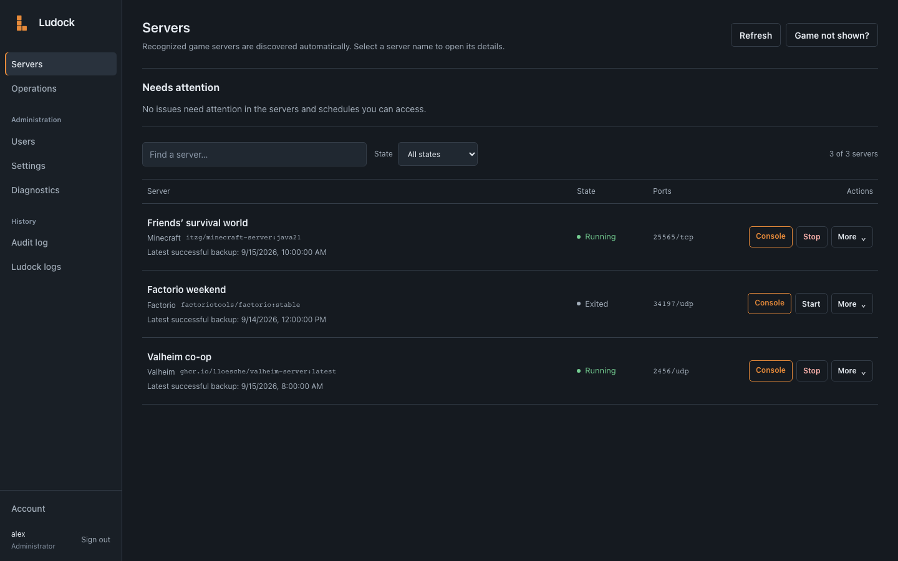
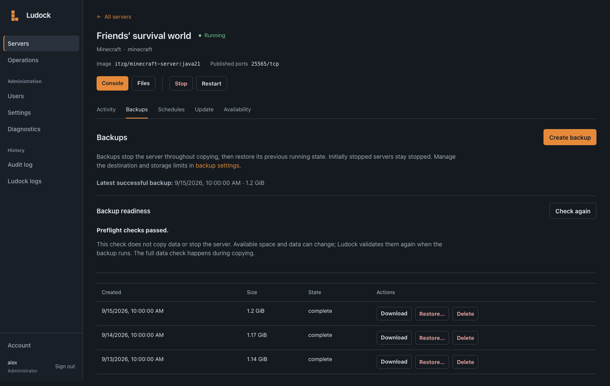
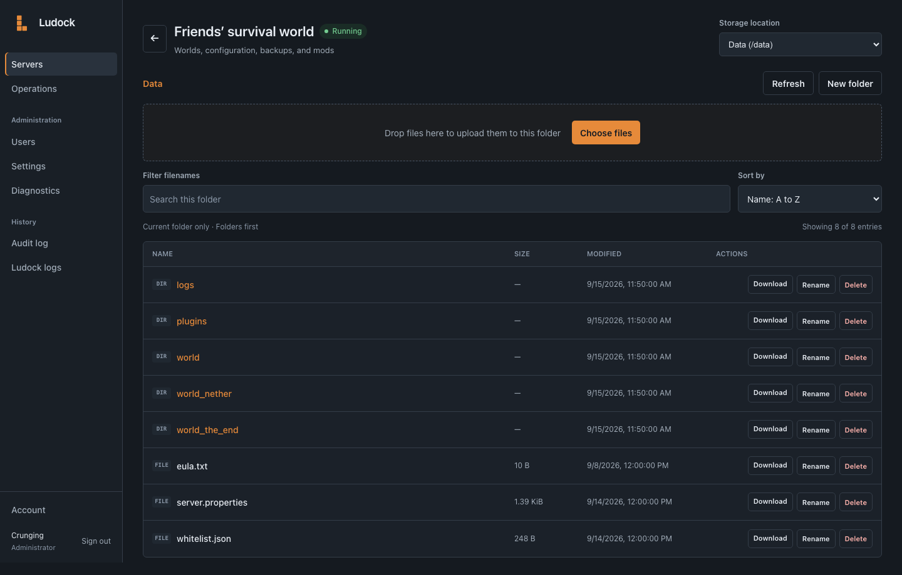

# Ludock

> **Beta:** Ludock is currently in beta. Expect bugs and changes as it develops.
> Keep independent backups of important game data, and
> [report issues](https://github.com/Crunging/Ludock/issues).

Ludock is a self-hosted control panel for existing Docker game servers. It
starts and stops servers, provides game consoles and file access, and handles
backups, schedules, availability alerts, and updates through existing Compose
projects.

Recognized game images appear automatically unless explicitly opted out.
Unrecognized images require `ludock.enable: "true"`. Docker Compose, Portainer,
Dockge, or the Docker CLI remains the configuration owner: Ludock does not
provision servers or edit their definitions.

## Screenshots

The current interface, shown with demo servers and data.

**Servers** — status, ports, recent backups, and everyday controls.



<details>
<summary>Backups and file access</summary>

**Backups** — readiness checks and retained archives for a server.



**Files** — browse and manage files inside approved server data roots.



</details>

## Run with Docker

Use Docker with [Compose 2.24.0 or later](https://docs.docker.com/reference/compose-file/services/#required).
Save [`compose.yaml`](./compose.yaml) on your game-server host and run:

```bash
docker compose up -d
```

No `.env` file or extra game labels are needed for recognized images.
Open `http://<docker-host>:3000` and retrieve the one-time setup code:

```bash
docker compose logs ludock
```

Use the code to create the first administrator within five minutes. If it expires,
run `docker compose restart ludock` for a new code.

The example creates separate volumes for Ludock application data and backups.
Existing game containers and game-data volumes stay in place.

Recognized servers appear automatically. Enable backups in **Settings → Backup
storage**; the default storage is already mounted.

Ludock images target **Linux AMD64 and ARM64**; individual game images may
support fewer platforms. Backups require downtime. Compose updates require
read-only access to the owner's source files; standalone containers are updated
through their original manager.

Docker socket access grants host-level power, even with a read-only socket
mount. Run one Ludock instance per Docker host, keep it on a trusted network,
and use an HTTPS reverse proxy for remote access.

## Optional configuration

Most configuration happens in the browser. For deployment settings, copy
[`.env.example`](./.env.example) to `.env` beside `compose.yaml`, uncomment only
the values you need, and recreate Ludock:

```bash
docker compose up -d --force-recreate ludock
```

Compose update access needs a read-only source mount; see
[Operations](./docs/OPERATIONS.md#compose-updates) for that setup.

## Documentation

- [Operations](./docs/OPERATIONS.md): game images and labels, deployment settings,
  permissions, files, backups, Compose updates, schedules, alerts, and recovery.
- [Development instructions](./AGENTS.md): local setup, code boundaries, tests,
  and dependency/image updates.
- [Development and CI](./docs/DEVELOPMENT.md): Bun execution, checks, and release tooling.
- [Security](./SECURITY.md): deployment boundary and vulnerability reporting.

Licensed under the [MIT License](./LICENSE).
