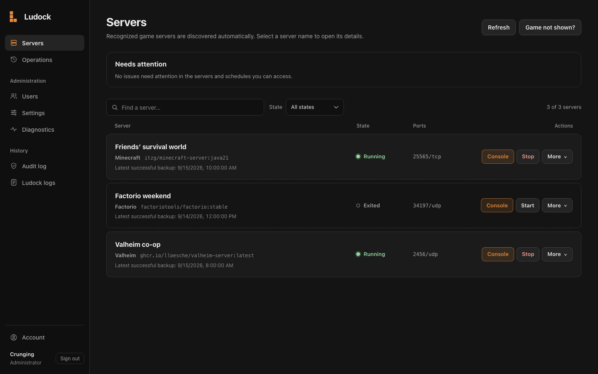
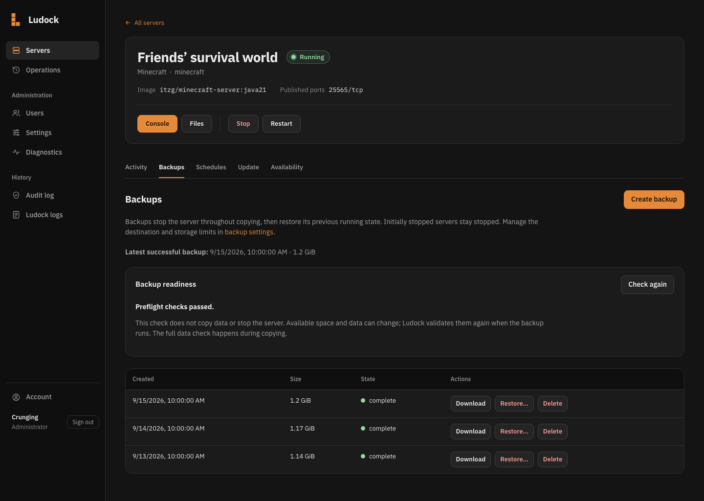
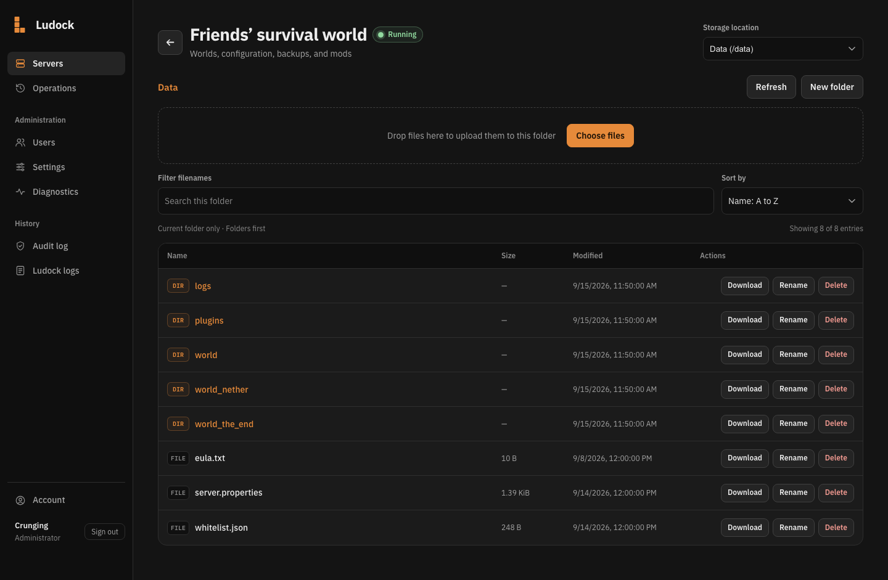

# Ludock

> **Beta:** Ludock is currently in beta. Expect bugs and changes as it develops.
> Keep independent backups of important game data, and
> [report issues](https://github.com/Crunging/Ludock/issues).

Ludock is a self-hosted web panel for the Docker game servers you already run.
Start and stop them, use their consoles, manage their files, take backups,
schedule restarts, get outage alerts, and update Compose services from your
browser. Compose, Portainer, Dockge, or the Docker CLI stays in charge of each
server's configuration; Ludock never creates or edits it.

## Screenshots

**Servers**: state, the address players connect to, the latest backup, and
everyday controls.



<details>
<summary>Backups and file access</summary>

**Backups**: readiness checks and retained archives for a server.



**Files**: browse and manage files inside a server's data folders.



</details>

## Quick start

You need Docker with [Compose 2.24.0 or later](https://docs.docker.com/reference/compose-file/services/#required).
Ludock's image supports Linux on AMD64 and ARM64; some game images support fewer
platforms.

1. Save [`compose.yaml`](./compose.yaml) on the host that runs your game
   servers, then start Ludock:

   ```bash
   docker compose up -d
   ```

2. Open `http://<docker-host>:3000`. Print the one-time setup code and use it to
   create the first administrator within five minutes. If it expires,
   `docker compose restart ludock` prints a new one.

   ```bash
   docker compose logs ludock
   ```

3. Servers using [supported game images](./docs/OPERATIONS.md#supported-games)
   appear automatically. For any other image, add the label
   `ludock.enable: "true"` to its container.

4. To turn on backups, open **Settings → Backup storage** and save. The example
   already mounts a `backups` volume. Backups stop the server while they copy.

Ludock keeps its own data and your backups in separate volumes; your game
containers and their data stay where they are.

Most settings live in the browser. For deployment options, copy
[`.env.example`](./.env.example) to `.env`, uncomment what you need, and run
`docker compose up -d --force-recreate ludock`. Updating servers through Compose
also needs a read-only mount of their Compose files; see
[Compose updates](./docs/OPERATIONS.md#compose-updates).

## Security

Access to the Docker socket gives control of the whole host, even when it's
mounted read-only. Run one Ludock per Docker host, keep it on a trusted network,
and use an HTTPS reverse proxy for remote access. See [SECURITY.md](./SECURITY.md).

## Documentation

- [Operations](./docs/OPERATIONS.md): deployment, adding servers, labels,
  consoles, files, backups, updates, schedules, alerts, access, and recovery.
- [Development](./docs/DEVELOPMENT.md): local setup, checks, releases, and
  dependency updates.
- [Security](./SECURITY.md): reporting vulnerabilities and deploying safely.

Licensed under the [MIT License](./LICENSE).
